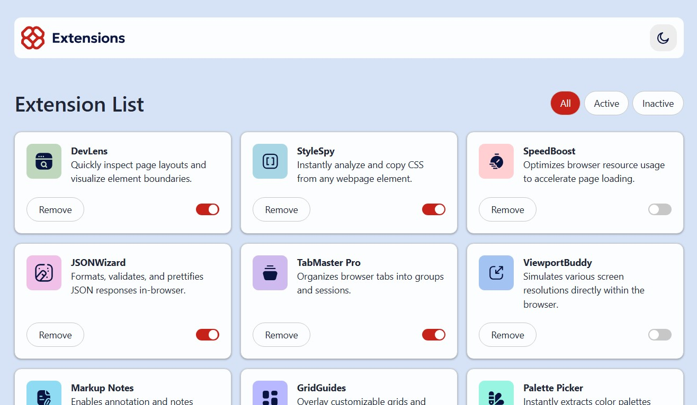

# Browser Extension Manager

This is a [Browser Extension Manager](https://bem-itk.vercel.app/).

## Table of contents

- [Overview](#overview)
  - [Screenshot](#screenshot)
  - [Links](#links)
- [My process](#my-process)
  - [Built with](#built-with)
  - [What I learned](#what-i-learned)
  - [Continued development](#continued-development)
- [Author](#author)
- [Acknowledgments](#acknowledgments)

## Overview

### Screenshot



### Links

- Solution URL: [see livr](https://github.com/itksweb/browser-extension-manager)
- Live Site URL: [source code](https://bem-itk.vercel.app/)

## My process

### Built with

- [React](https://reactjs.org/) - JS library
- [Tailwind CSS](https://tailwindcss.com/)

### What I learned

```js
// I became better at writing code for dark and light mode.

const retrieveUserPref = () => {
  // this block of code attempts to retrieve the users preferred color scheme
  if (localStorage.getItem("theme")) {
    return localStorage.getItem("theme");
  }
  // if there isn't any stored, this block retrieves the user's preferred device dark mode setting
  if (window.matchMedia("(prefers-color-scheme: dark)").matches) {
    return "dark";
  }
};

useEffect(()=>{
    // this funtion sets the theme to the users preference on page load
    const info = retrieveUserPref();
    if (info && info !== theme) {
      setTheme(info);
      setIsDark(!isDark)
    }
  },[])

// I prgrammatically applied css classes based on the selection of the user
className={`py-2 px-4 rounded-full ml-1.5 btn ${visibleData === item ? "btn-active":"btn-normal"}`}

```

## Author

- WhatsApp - [here](https://wa.me/2348060719978)
- LinkedIn - [here](https://www.linkedin.com/in/kingsleyikpefan)
